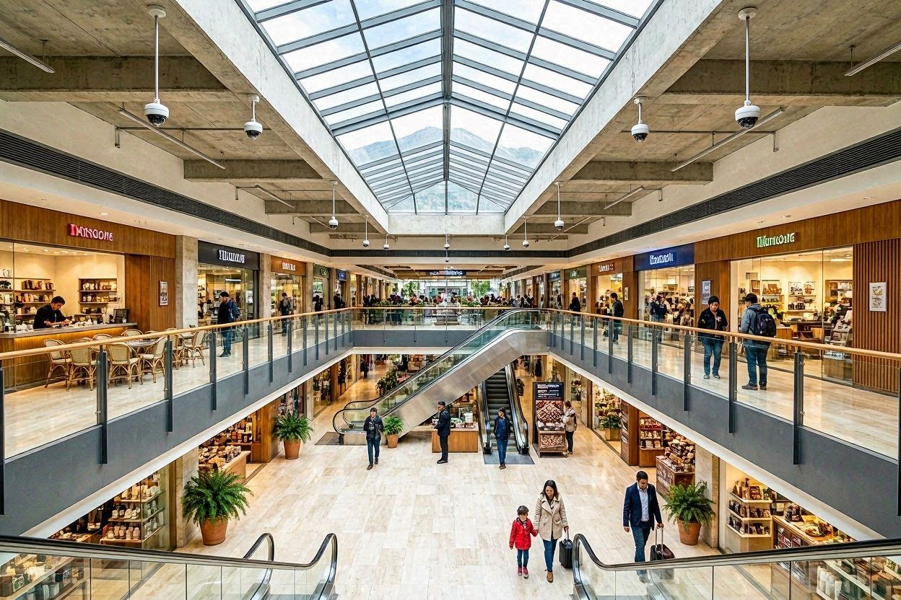

# SecureVision – Landing Page

## Información del proyecto

| Campo | Detalle |
|---|---|
| **Nombre del proyecto** | SecureVision – Empresa de Seguridad Electrónica |
| **Nombre del estudiante** | Jhon Anderson Liscano Carbo |
| **Tema asignado** | Empresa de seguridad electrónica y control de acceso |
| **Docente** | Ing. Geovanny Brito |
| **Asignatura** | Fundamentos de Sistemas Web |
| **Institución** | Universidad de las Fuerzas Armadas – ESPE Sede Santo Domingo |
| **Curso** | Desarrollo Web – Parcial 3, Tarea 1 |
| **Fecha de entrega** | 06 de julio de 2026 |

---

## Descripción

Landing page profesional para **SecureVision**, empresa ficticia ecuatoriana especializada en soluciones integrales de seguridad electrónica: videovigilancia CCTV, sistemas de alarma, control de acceso biométrico, monitoreo 24/7, instalación y mantenimiento de equipos, y soporte técnico.

La página fue diseñada con enfoque **mobile-first**, es completamente responsive y comunica de forma clara los servicios, planes y propuesta de valor de la empresa hacia su público objetivo en Ecuador.

**Mensaje principal:** *"Protegemos lo que más importa para ti — tecnología de punta, monitoreo continuo y soporte garantizado en Ecuador."*

---

## Paleta de colores (variables CSS)

### Colores principales asignados

| Variable CSS | Hex | Uso |
|---|---|---|
| `--color-primario` | `#394F63` | Navbar, footer, botones principales, títulos |
| `--color-secundario` | `#B5C8D8` | Bordes, texto secundario sobre fondos oscuros |
| `--color-acento` | `#D3E7EF` | Badges, gradientes, iconos destacados, divisores |
| `--color-suave` | `#D9D5E8` | Gradientes de iconos, tarjetas de testimonios |

### Variantes tonales (generadas para el proyecto)

| Variable CSS | Hex | Uso |
|---|---|---|
| `--color-primario-oscuro` | `#253544` | Footer, hero, banner CTA, sombras de fondo |
| `--color-primario-claro` | `#4F6D85` | Hover de botones, plan empresarial destacado |
| `--color-fondo` | `#F4F8FB` | Fondo de inputs, tarjetas de testimonios |
| `--color-fondo-alterno` | `#EAF2F8` | Fondo de secciones alternas (servicios, galería) |
| `--color-texto` | `#1E2A35` | Párrafos sobre fondo claro |
| `--color-texto-claro` | `#5A6E7F` | Subtítulos, descripciones, roles de testimonios |

### ¿Qué es y para qué sirve una variable CSS?

Una variable CSS (también llamada *custom property*) almacena un valor reutilizable. Se declara con `--nombre` dentro de `:root` para que sea global, y se consume con `var(--nombre)`.

**En este proyecto sirven para:**
- Centralizar la paleta: cambiar `--color-primario` en `variables.css` actualiza automáticamente navbar, footer y todos los botones.
- Evitar repetir códigos hexadecimales en decenas de reglas.
- Mantener coherencia visual entre los tres archivos CSS.
- Mejorar legibilidad: `var(--color-primario)` es más expresivo que `#394F63`.

```css
:root {
    --color-primario:        #394F63;
    --color-secundario:      #B5C8D8;
    --color-acento:          #D3E7EF;
    --color-suave:           #D9D5E8;
    --fuente-base:           16px;
    --espacio-md:            16px;
    --radio-borde:           8px;
    --sombra-media:          0 4px 24px rgba(57, 79, 99, 0.18);
}
```

---

## Tecnologías utilizadas

- **HTML5** semántico (`<header>`, `<nav>`, `<main>`, `<section>`, `<article>`, `<aside>`, `<footer>`)
- **CSS3** externo modular (3 archivos: `variables.css`, `estilos.css`, `secciones.css`)
- **Bootstrap 5.3.3** (grid, navbar, carousel, utilidades)
- **Bootstrap Icons 1.11.3** (iconos: cámara, escudo, huella, campana, pantalla, herramientas, auriculares, etc.)
- **Google Fonts** – Poppins (300, 400, 500, 600, 700, 800)
- **Git / GitHub** para control de versiones
- **GitHub Pages** para publicación

---

## Tipografía

Fuente: **Poppins** — importada desde Google Fonts.

| Elemento | Tamaño móvil | Tamaño tableta | Tamaño escritorio | Uso |
|---|---|---|---|---|
| `<h1>` | 28px | 40px | 56px | Título principal del hero |
| `<h2>` / `.seccion-titulo` | 24px | 32px | 35px | Títulos de sección |
| `<h3>` | 18px | 18px | 18px | Títulos de tarjetas |
| Párrafo base | 16px | 16px | 16px | Descripciones y texto general |
| Texto pequeño | 14px | 14px | 14px | Labels, roles, pie de tarjeta |
| Texto hero | 32px | 44px | 56px | `.hero-titulo` |

Pesos usados: 300 · 400 · 500 · 600 · 700 · 800.

---

## Iconografía

Biblioteca: **Bootstrap Icons 1.11.3** — integrada mediante CDN.

| Icono | Clase Bootstrap Icons | Sección | Relación con el contenido |
|---|---|---|---|
| Cámara de video | `bi-camera-video-fill` | Servicio 1, Hero flotante | Videovigilancia CCTV |
| Escudo con candado | `bi-shield-lock` | Hero flotante, navbar CTA | Protección y seguridad |
| Huella digital | `bi-fingerprint` | Servicio 3, Hero flotante | Control de acceso biométrico |
| Campana / alarma | `bi-bell-fill` | Servicio 2 | Sistemas de alarma |
| Pantalla / monitor | `bi-display` | Servicio 4 | Monitoreo central |
| Herramientas | `bi-tools` | Servicio 5 | Instalación y mantenimiento |
| Auriculares | `bi-headset` | Servicio 6 | Soporte técnico |
| Verificado | `bi-patch-check-fill` | Nosotros | Certificación de confianza |
| Personas | `bi-people-fill` | Estadísticas | Clientes satisfechos |
| Estrella | `bi-star-fill` | Estadísticas, Testimonios | Calidad y satisfacción |
| Ubicación | `bi-geo-alt-fill` | Contacto, Footer | Dirección |
| Teléfono | `bi-telephone-fill` | Contacto, Footer | Número de contacto |
| Sobre | `bi-envelope-fill` | Contacto, Footer | Correo electrónico |
| Redes sociales | `bi-facebook`, `bi-instagram` | Contacto, Footer | Acceso a redes sociales |

---

## Estructura del proyecto

```
liscano-jhon-landing/
│
├── index.html              ← Página principal (HTML5 semántico)
│
├── css/
│   ├── variables.css       ← Custom properties (paleta, tipografía, espaciados, sombras, transiciones)
│   ├── estilos.css         ← Importaciones, reset, tipografía, utilidades, navbar, hero, botones, media queries
│   └── secciones.css       ← Nosotros, Servicios (grid), Planes, Galería/Carrusel,
│                              Estadísticas, Testimonios, Contacto, CTA Banner, Footer
│
├── img/
│   ├── logo.png            ← Logotipo de la empresa
│   ├── hero.jpeg           ← Imagen principal del hero
│   ├── nosotros.jpeg       ← Imagen sección Quiénes somos
│   ├── servicio-01.jpeg    ← Videovigilancia CCTV
│   ├── servicio-02.jpeg    ← Sistemas de alarma
│   ├── servicio-03.jpeg    ← Control de acceso biométrico
│   ├── servicio-04.jpeg    ← Centro de monitoreo
│   ├── servicio-05.jpeg    ← Instalación y mantenimiento
│   ├── servicio-06.jpeg    ← Soporte técnico
│   ├── proyecto-01.jpg     ← Centro Comercial CCI, Quito (carrusel)
│   ├── proyecto-02.jpeg    ← Torres Greenpoint, Guayaquil (carrusel)
│   ├── proyecto-03.jpeg    ← Planta Industrial Indurama, Cuenca (carrusel)
│   └── proyecto-04.jpeg    ← Conjunto Los Cerezos, Ambato (carrusel)
│
├── docs/                   ← Informe técnico en PDF
└── README.md               ← Este archivo
```

---

## Secciones de la landing page

1. **Navbar** – Logo, menú responsive con hamburguesa, botón CTA "Solicitar cotización" (`fixed-top`)
2. **Hero** – Título H1, frase de valor, descripción, 2 botones CTA, mini estadísticas (+600 clientes, 12+ años, 24/7), 3 iconos flotantes animados
3. **Quiénes somos** – Historia, valores, lista de diferenciadores, imagen con badge de certificación
4. **Servicios** – 6 tarjetas con imagen, icono, título, descripción y enlace (CSS Grid mobile-first)
5. **Planes** – 3 planes (Hogar $45/mes · Empresarial $120/mes · Corporativo a medida) con listas de características
6. **Proyectos** – Carrusel Bootstrap con 4 instalaciones destacadas en Ecuador (Quito, Guayaquil, Cuenca, Ambato)
7. **Estadísticas** – 4 indicadores: +600 clientes · 12+ años · +8K cámaras · 98% satisfacción
8. **CTA Banner** – Llamada a la acción para agendar visita técnica gratuita
9. **Testimonios** – 3 tarjetas con reseña 5 estrellas, nombre y rol del cliente
10. **Contacto** – Formulario completo (`<form>`) + información de contacto (`<aside>`)
11. **Footer** – Marca, navegación rápida, redes sociales, datos de contacto, derechos reservados

---

## Estructura semántica HTML5

| Etiqueta | Uso en el proyecto |
|---|---|
| `<header>` | Barra de navegación fija con logo y menú |
| `<nav>` | Menú principal con `<ul>` / `<li>` y botón hamburguesa |
| `<main>` | Envuelve todo el contenido principal (hero → contacto) |
| `<section>` | Cada bloque temático: `#inicio`, `#nosotros`, `#servicios`, `#planes`, `#proyectos`, `#testimonios`, `#contacto` |
| `<article>` | Cada tarjeta de servicio, plan y testimonio |
| `<aside>` | Información de contacto complementaria al formulario |
| `<footer>` | Cierre institucional con datos y derechos |

**Jerarquía de títulos:** único `<h1>` en el hero → `<h2>` en cada sección → `<h3>` en tarjetas individuales.

---

## Componentes Bootstrap 5 utilizados

| Componente | Clases | Sección |
|---|---|---|
| Contenedor | `container` | Todas las secciones |
| Sistema de grilla | `row`, `col-12`, `col-md-6`, `col-lg-4` | Nosotros, Planes, Testimonios, Footer |
| Navbar | `navbar`, `navbar-expand-lg`, `navbar-collapse` | Header |
| Carrusel | `carousel`, `carousel-item`, `carousel-indicators` | Proyectos |
| Utilidades display | `d-none`, `d-lg-block`, `d-flex` | Hero, Estadísticas |
| Utilidades espaciado | `mb-5`, `mt-3`, `g-4`, `gap-3` | Múltiples secciones |
| Utilidades texto | `text-center`, `fw-bold`, `text-start` | Encabezados, carrusel |
| Alineación | `align-items-center`, `justify-content-center` | Hero, Planes, CTA |
| Imagen responsive | `img-fluid` | Hero, Nosotros |
| Overflow / Rounded | `overflow-hidden`, `rounded-3` | Carrusel, imagen nosotros |

---

## Desarrollo del CSS externo modular

**`variables.css`** — Define todas las custom properties: 10 colores base, variantes con transparencia (hex + canal alpha), tipografía, 6 niveles de espaciado, 2 radios de borde, 3 niveles de sombra y 2 velocidades de transición.

**`estilos.css`** — Punto de entrada: importa `variables.css` y `secciones.css`, define reset, tipografía, utilidades (`.seccion-titulo`, `.divisor`, `.badge-seccion`), los 3 botones personalizados (`.btn-primario`, `.btn-secundario`, `.btn-blanco`), navbar, hero, iconos flotantes, formulario y media queries generales.

**`secciones.css`** — Estilos específicos por sección: nosotros, servicios (CSS Grid), planes, galería/carrusel, estadísticas, testimonios, contacto, CTA banner, footer y sus media queries particulares.

**Técnicas destacadas:**
- Sombras en 3 niveles (`--sombra-suave`, `--sombra-media`, `--sombra-fuerte`) para jerarquía visual.
- Hover de tarjetas con `transform: translateY(-8px)` y `transition`.
- Hero con `linear-gradient` + imagen de fondo a `opacity: 0.18` + `clip-path` elíptico en `::after`.
- Iconos flotantes con animación `@keyframes flotar`.

---

## Aplicación de mobile-first

El diseño parte de 375px y escala progresivamente con `@media (min-width: ...)`.

| Breakpoint | Comportamiento |
|---|---|
| Base (375px) | 1 columna · navbar hamburguesa · hero sin imagen lateral · estadísticas 2 cols (`col-6`) |
| Tableta (768px) | Servicios 2 cols · Nosotros imagen + texto lado a lado · Testimonios 2 cols · `h1` 40px · `h2` 32px · carrusel 440px |
| Escritorio (992px+) | Servicios 3 cols · imagen nosotros 420px (breakpoint propio del CSS Grid) |
| Escritorio grande (1200px+) | Hero imagen lateral visible · `h1` 56px · `h2` 35px · iconos flotantes más grandes · carrusel 500px |

```css
/* Grid de servicios — mobile first */
.servicios-grid {
    display: grid;
    grid-template-columns: 1fr;          /* móvil: 1 columna */
    gap: var(--espacio-lg);
}
@media (min-width: 768px) {
    .servicios-grid { grid-template-columns: repeat(2, 1fr); }  /* tableta: 2 columnas */
}
@media (min-width: 992px) {
    .servicios-grid { grid-template-columns: repeat(3, 1fr); }  /* escritorio: 3 columnas */
}
```

---

## Fragmentos de código clave

### Variables CSS (`css/variables.css`)
```css
:root {
    --color-primario:        #394F63;
    --color-acento:          #D3E7EF;
    --fuente-base:           16px;
    --espacio-md:            16px;
    --radio-borde:           8px;
    --sombra-media:          0 4px 24px rgba(57, 79, 99, 0.18);
}
```

### Importación modular (`css/estilos.css`)
```css
@import url('variables.css');
@import url('secciones.css');
@import url('https://fonts.googleapis.com/css2?family=Poppins:wght@300;400;500;600;700;800&display=swap');
```

### Navbar responsive Bootstrap (`index.html`)
```html
<nav class="navbar navbar-expand-lg navbar-securevision fixed-top"
     aria-label="Navegación principal">
    <div class="container">
        <a class="navbar-brand" href="#inicio">...</a>
        <button class="navbar-toggler" type="button"
                data-bs-toggle="collapse" data-bs-target="#menuPrincipal"
                aria-controls="menuPrincipal" aria-expanded="false"
                aria-label="Abrir menú">
            <span class="navbar-toggler-icon"></span>
        </button>
        <div class="collapse navbar-collapse" id="menuPrincipal">
            <ul class="navbar-nav ms-auto gap-1">...</ul>
        </div>
    </div>
</nav>
```

### Carrusel Bootstrap 5 (`index.html`)
```html
<div id="carruselProyectos" class="carousel slide"
     data-bs-ride="carousel" data-bs-interval="4000">
    <div class="carousel-inner rounded-3 overflow-hidden">
        <div class="carousel-item active galeria-slide">
            
            <div class="carousel-caption galeria-slide-caption text-start">
                <h5>Centro Comercial CCI</h5>
                <p>128 cámaras IP 4K · Quito, 2024</p>
            </div>
        </div>
    </div>
</div>
```

---

## Cómo abrir la página

### Opción A – Abrir directamente
1. Descarga o clona el repositorio.
2. Abre la carpeta `landingpage-securevision-liscanojhon/`.
3. Doble clic en `index.html` o ábrelo con tu navegador preferido.

### Opción B – Live Server (VS Code)
1. Instala la extensión **Live Server**.
2. Abre la carpeta en VS Code.
3. Clic derecho sobre `index.html` → **"Open with Live Server"**.

### Opción C – GitHub Pages
> `[https://[usuario].github.io/liscano-jhon-landing/](https://github.com/jaliscano-oss/landingpage-securevision-liscanojhon)`

---

## Pruebas responsive

| Tamaño | Dispositivo simulado | Resultado |
|---|---|---|
| 375px | Teléfono móvil | Navbar hamburguesa · hero apilado · servicios 1 col · sin desbordamiento ✅ |
| 768px | Tableta | Servicios 2 cols · nosotros imagen+texto · menú horizontal ✅ |
| 1366px | Escritorio | Servicios 3 cols · imagen lateral hero · planes 3 cols · footer 4 cols ✅ |

---

## Fuentes de imágenes e iconos

- **Bootstrap Icons 1.11.3** – [icons.getbootstrap.com](https://icons.getbootstrap.com/) (licencia MIT)
- **Imágenes** – Pexels / Unsplash (licencia libre comercial). Sustituir por imágenes reales antes de producción.
- **Tipografía** – Google Fonts · Poppins (licencia OFL)

---

## Capturas de pantalla

| Móvil (375px) | Tableta (768px) | Escritorio (1366px) |
|---|---|---|
| ./img| *(captura)* | *(captura)* |

---

## Referencias

- Bootstrap. (2024). *Bootstrap 5 Documentation*. https://getbootstrap.com/docs/5.3/
- Bootstrap. (2024). *Bootstrap Icons*. https://icons.getbootstrap.com
- Google. (2024). *Poppins*. Google Fonts. https://fonts.google.com/specimen/Poppins
- MDN Web Docs. (2024). *HTML: HyperText Markup Language*. https://developer.mozilla.org/es/docs/Web/HTML
- MDN Web Docs. (2024). *CSS custom properties*. https://developer.mozilla.org/es/docs/Web/CSS/Using_CSS_custom_properties

---

*Proyecto académico – Jhon Anderson Liscano Carbo – ESPE Santo Domingo – 2026*
